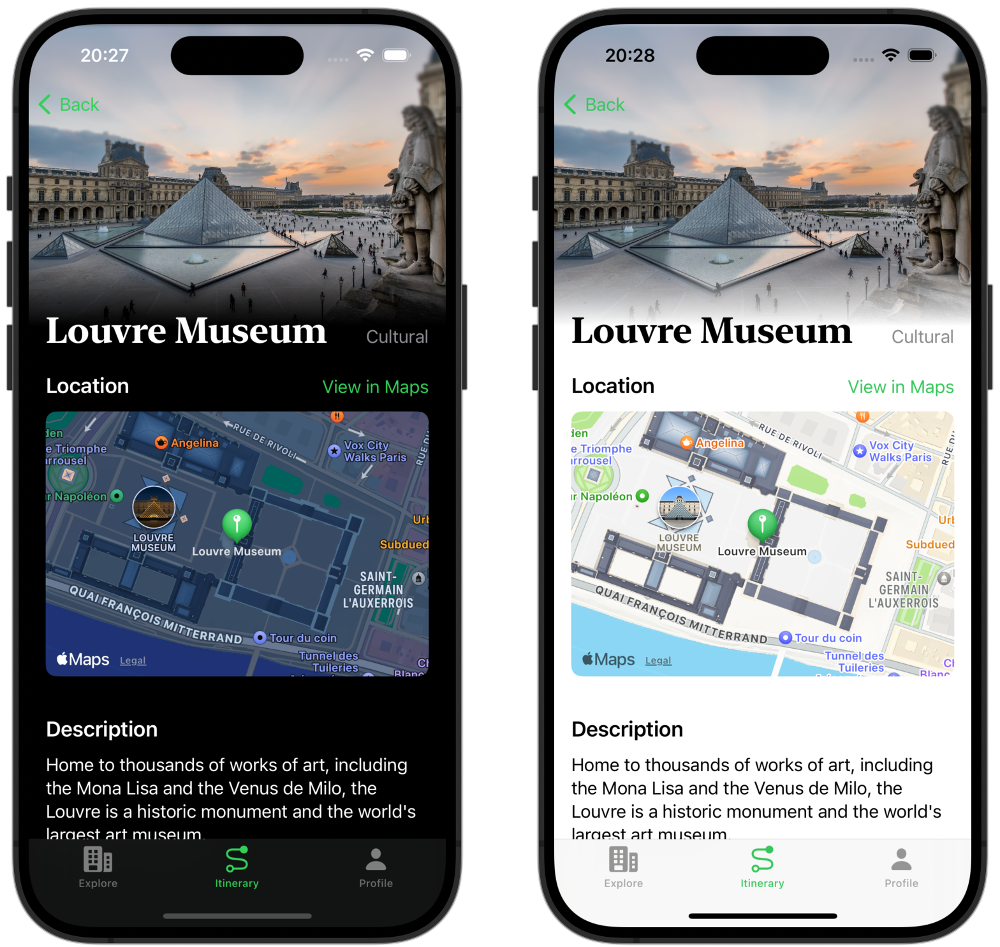

# iJourney

An iOS app developed with SwiftUI that integrates ChatGPT for travel information. This is the graduation project I did in ZJUT(Zhejiang University of Technology) for my bachelor's degree.

## Technology Stack

- SwiftUI
- MapKit
- Azure's OpenAI API

## Documentation

All documents regarding this graduation project work can be found under `./Documents`.